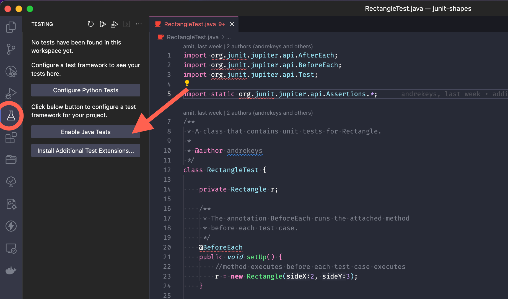
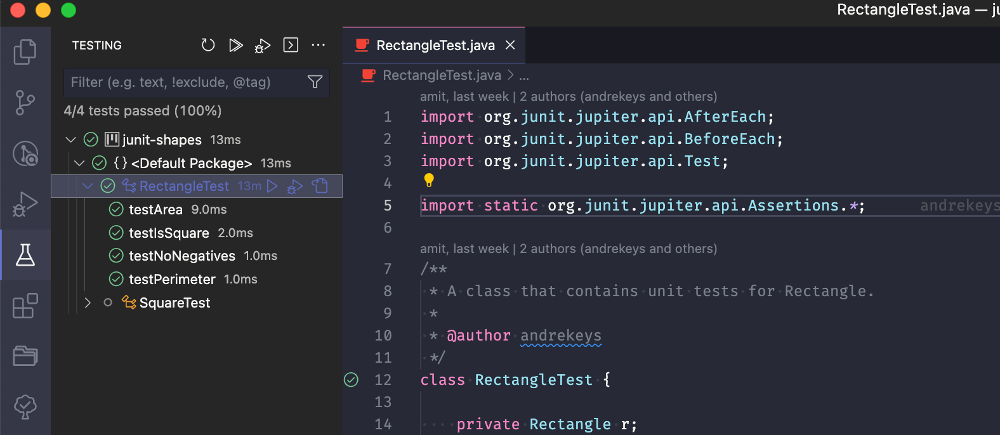

# JUnit Testing Example

The purpose of this example is to show JUnit5 in action!

Contained herein is a simple representation of Rectangles 
and Squares, and unit tests for each. 

See RectangleTest and SquareTest for the JUnit unit tests.

# Running JUnit

JUnit can be simple to set up, provided you are careful.

## In Intellij/Eclipse

Intellj and Eclipse integrate JUnit so that a developer can easily run and debug tests.
They also provide nice documentation for that process. 

Intellij will even detect if you don't have the JUnit library
downloaded, and will do it for you. 

- [Intellij](https://www.jetbrains.com/help/idea/junit.html#intellij)
- [Eclipse](https://www.eclipse.org/community/eclipse_newsletter/2017/october/article5.php)

## In VSCode

VSCode can be considerably more challenging to run and debug tests because
of its decentralized and plugin based build tools. 

If setting up VSCode for the first time, use [this guide](https://code.visualstudio.com/docs/languages/java#_install-visual-studio-code-for-java)
to configure VSCode properly. Basically, just make sure that VSCode is using the official 
Java Coding or Extension Pack from Microsoft.

When configured, proceed with the below:

1. Click the "Testing Tab" on the sidebar (looks like a beaker)

2. Click "Enable Java Tests"
3. When prompted, select JUnit Jupiter from the list of libraries

If this doesn't work the first time, try right-clicking on the project in VSCode, 
and selecting "Clean Workspace"

When configured properly, the Testing Tab (the beaker icon) will show each test class and each test case
within, therefore allowing running and debugging within VSCode.

## From the Terminal

The easiest way to set up JUnit testing in your terminal
is by using the JUnit standalone test JAR file, found
[here.](https://repo1.maven.org/maven2/org/junit/platform/junit-platform-console-standalone/1.9.2/junit-platform-console-standalone-1.9.2.jar)

Simply download this jar and put it in the same directory 
as the Test class you want to run.

Compile the code with 

    javac -cp .:junit-platform-console-standalone-1.9.2.jar *.java

and run it with

    java -jar junit-platform-console-standalone-1.9.2.jar --class-path . --select-class RectangleTest

See more on running from the command line at this
[tutorial website.](https://www.baeldung.com/junit-run-from-command-line)
